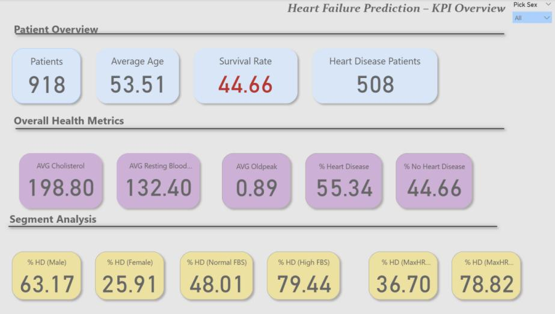
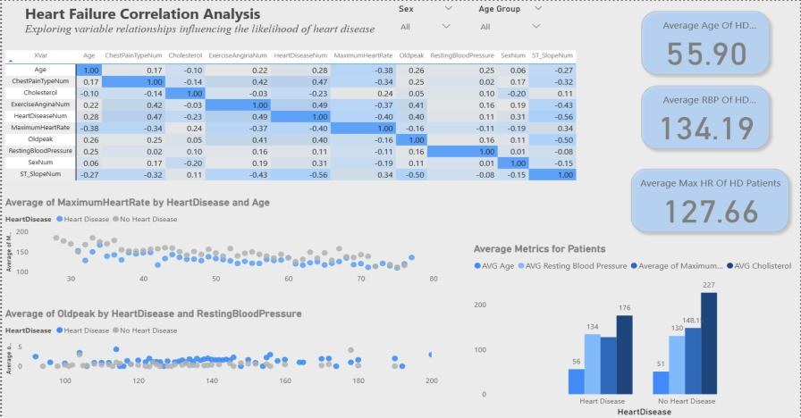
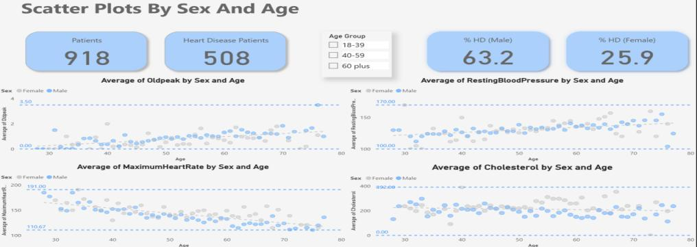
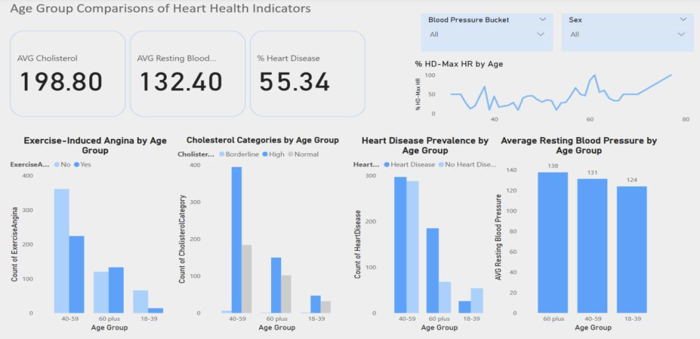
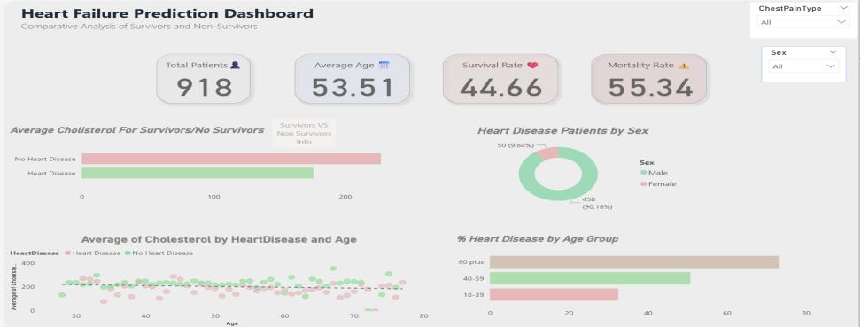
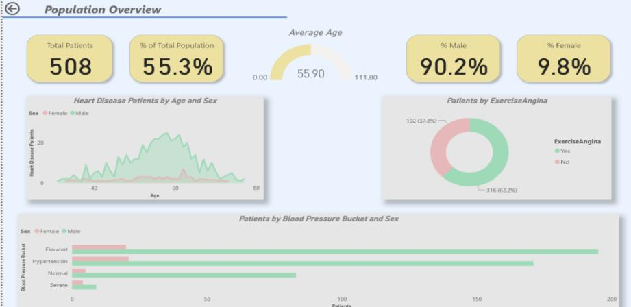
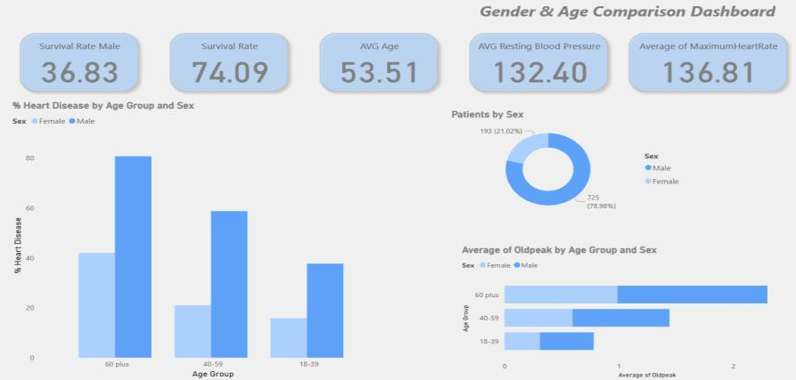
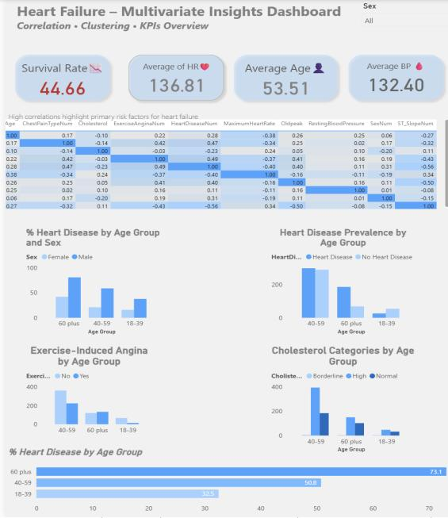

# Heart Failure Prediction — Power BI Analysis

## Overview

End-to-end Business Intelligence solution built in **Microsoft Power BI** for analysing clinical and demographic factors associated with heart failure. The project covers the full BI pipeline — from data cleaning and modelling to interactive dashboards — answering **16 research questions** on patient survival, risk factors and demographic patterns.

> Developed as part of the **Business Intelligence Tools II** course, MSc in Artificial Intelligence & Data Analytics.

---

## Dashboards

### KPI Overview


### Correlation Analysis Heatmap


### Scatter Plots by Sex and Age


### Age Group Comparisons


### Heart Failure Prediction Dashboard


### Population Overview


### Gender & Age Comparison


### Multivariate Insights


---

## Dataset

- **Source:** [Heart Failure Prediction Dataset — Kaggle](https://www.kaggle.com/datasets/fedesoriano/heart-failure-prediction)
- **Size:** 918 patients with clinical and demographic records
- **Key variables:** Age, Sex, ChestPainType, Cholesterol, FastingBloodSugar, RestingBP, MaxHR, ExerciseAngina, Oldpeak, ST_Slope, HeartDisease

---

## Key Findings

| Metric | Value |
|--------|-------|
| Total Patients | 918 |
| Heart Disease Patients | 508 (55.34%) |
| Overall Survival Rate | 44.66% |
| Average Age | 53.51 years |
| Male Survival Rate | 36.83% |
| Female Survival Rate | 74.09% |
| Avg Resting Blood Pressure | 132.40 mmHg |
| Avg Cholesterol | 198.80 mg/dl |

**Strongest predictors of heart disease (Pearson correlation):**
- Exercise Angina: r = **+0.49**
- Oldpeak (ST depression): r = **+0.41**
- Maximum Heart Rate: r = **−0.40**
- Age: r = **+0.28**

**Highest-risk demographic:** Males aged 60+ (heart disease rate: 82%)

---

## Research Questions Addressed

1. Data cleaning and preprocessing in Power Query
2. Building a suitable data model with DAX measures
3. Correlation matrix with heatmap
4. Scatter plots with predictive zones
5. Clustered bar charts for age group comparisons
6. KPI cards — survival rate, average age, mortality risk
7. Custom drillthrough reports for survivors vs non-survivors
8. Which factors are strongly associated with heart failure?
9. Are there differences based on gender or age?
10. Which demographic groups are most at risk?
11. Heatmaps, cluster visualisations and KPIs
12. Survival rate differences between genders at various ages
13. Can death probability be predicted using ejection fraction and diabetes?
14. What parameter combinations are most common among survivors?
15. How does high blood pressure affect survival?
16. Which variable has the highest correlation with mortality?

---

## Tools & Technologies

- **Microsoft Power BI Desktop**
- **Power Query** — data cleaning, type validation, value replacement, categorisation
- **DAX** — custom measures (KPIs, % Heart Disease, survival rates, Pearson correlation via CROSSJOIN)
- **Dataset:** CSV from Kaggle

---

## Files

```
├── ergasia.pbix     # Full Power BI report with all dashboards
└── README.md        # This file
```

> **Note:** The source dataset (`heart.csv`) is not included. Download it from [Kaggle](https://www.kaggle.com/datasets/fedesoriano/heart-failure-prediction) and load it into Power BI to refresh the report.

---

## Author

**Stefanos Stefanidis**
MSc Artificial Intelligence & Data Analytics
